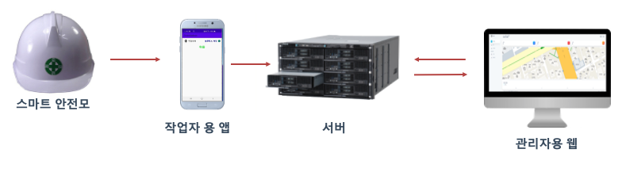
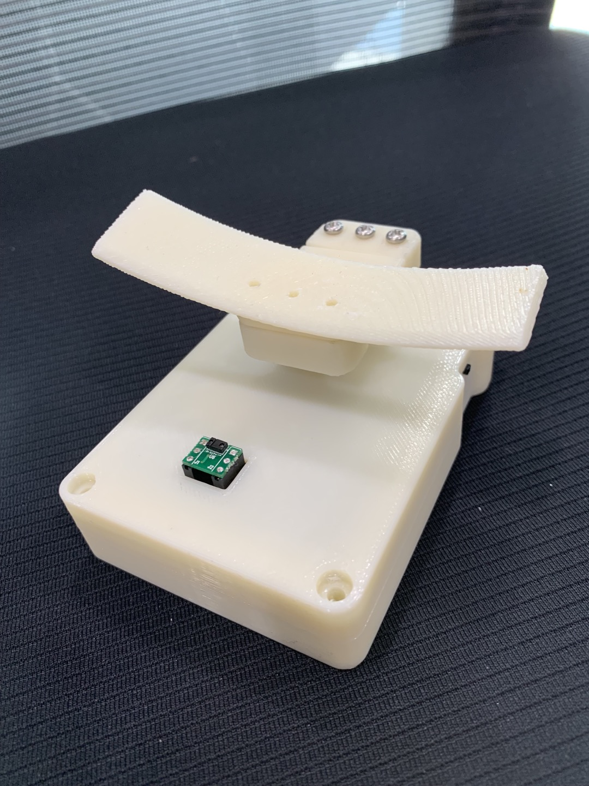
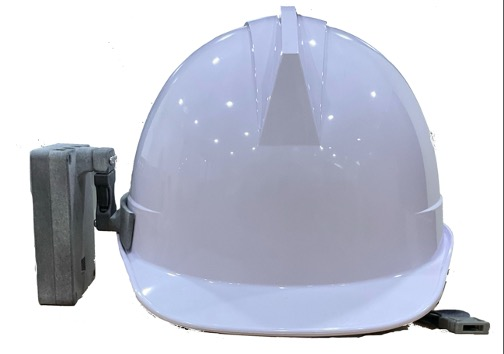

# SafetyAll


## Basic Overview

This repository is a web application for wearing protective gear and notification of fall detection.

---

## Getting Start

- Clone Plate-recognizer to your hard drive with `https://github.com/S-jooyoung/SafetyAll.git`
- Install yarn:

[MacOS]

```cmd
$ brew install yarn
```

[Windows]

```cmd
$ npm install yarn
```

- Install MUI:

```cmd
yarn add @mui/material @emotion/react @emotion/styled
```

- Run

```cmd
yarn start
```

---

## Function

- protective gear and ability to estimate falls.
- Warning pop-up function for falls.
- location tracking of workers using GPS information.

---

## System configuration.



---

## Prototype of device

|                            앞                            |                            뒤                            |                        결착상태                         |
| :------------------------------------------------------: | :------------------------------------------------------: | :-----------------------------------------------------: |
|  |  |  |

---

## Example

|                      착용 미착용                       |                        낙상감지                         |                           분석                           |
| :----------------------------------------------------: | :-----------------------------------------------------: | :------------------------------------------------------: |
|  |  |  |

---
## Reference
### [HW]
https://github.com/BAE-JI-WANG/SatetyAll_HW-FW
### [APP]
https://github.com/95Seo/SafetyAll_App

## Learn More

- React
  - [React : overview of the React documentation](https://pjreddie.com/media/files/papers/yolo_1.pdf)
  - [ReactRouter : server-side routing library for React](https://reactrouter.com/)
  - [MUI: The React UI library you alwats wanted](https://pjreddie.com/media/files/papers/YOLOv3.pdf)

---

## Contributing

Let's connect 👨‍💻 and forge the future together.😁✌

**Check the Repositories and don't forget to give a star.** 👇

:star: From [S-jooyoung](https://github.com/S-jooyoung)
